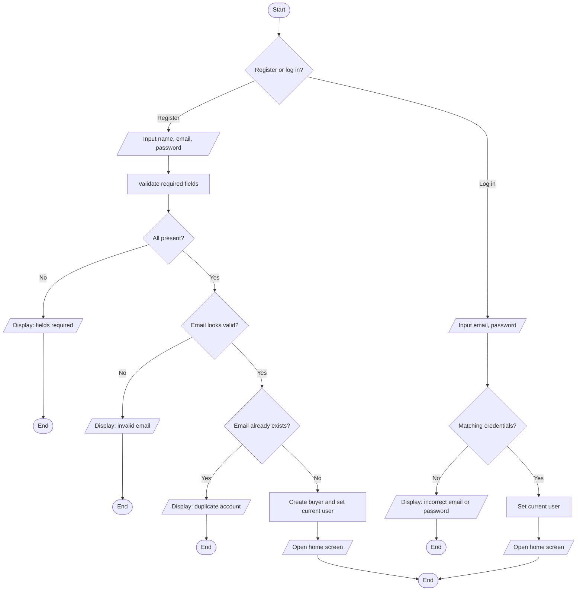
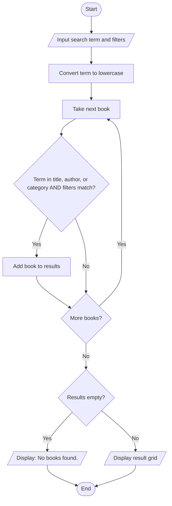
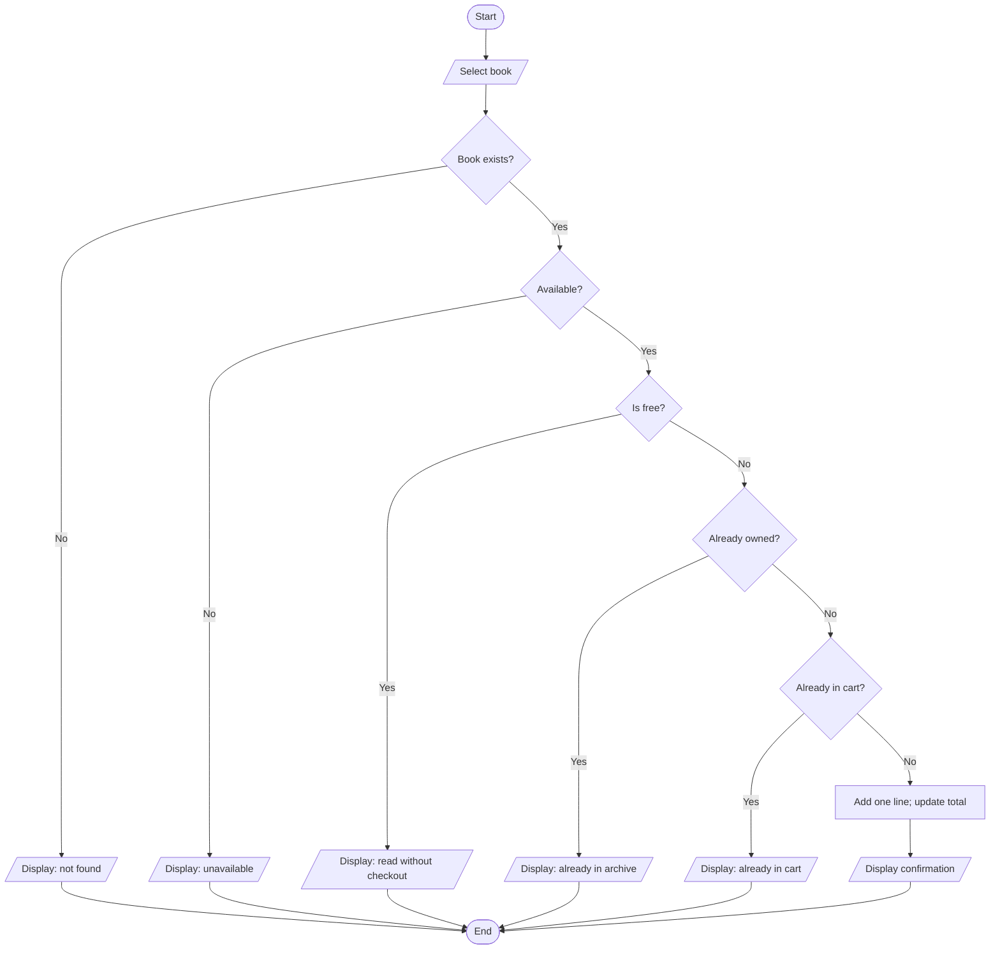
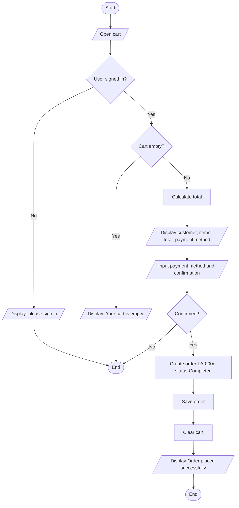
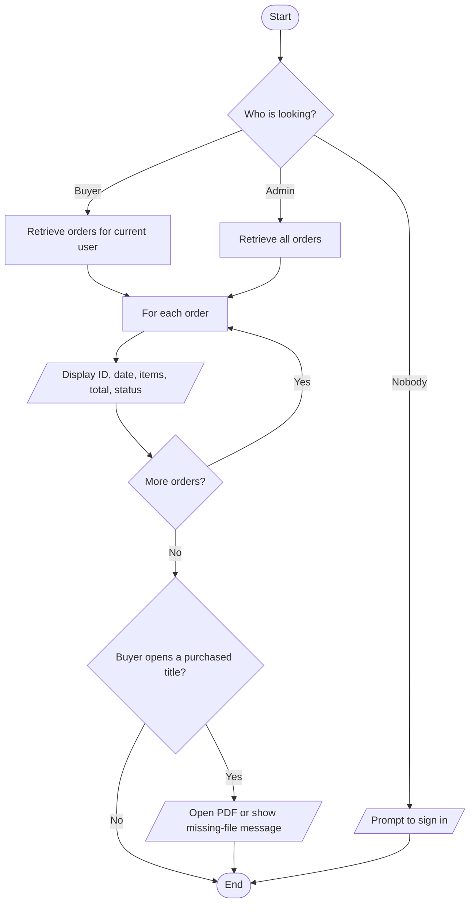
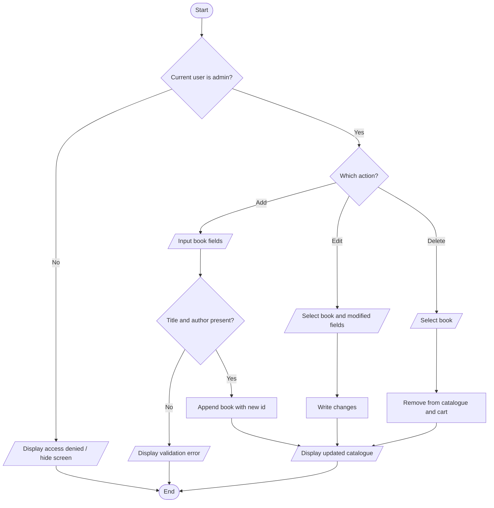
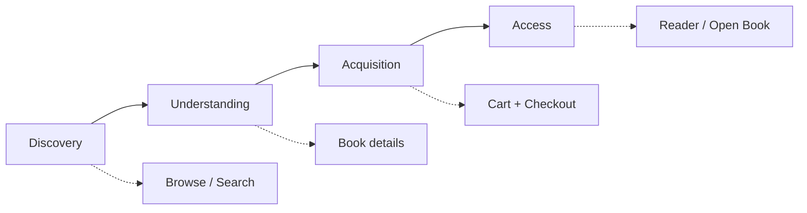

# 5. Flowcharts

Standard symbols used throughout:

| Symbol | Meaning |
| --- | --- |
| Rounded rectangle | Start / End |
| Parallelogram | Input / Output |
| Rectangle | Process |
| Diamond | Decision |
| Arrow | Flow |

Obsidian and GitHub both render the Mermaid diagrams below. They are the pictures of [[04-Algorithms]].

---

## 5.1 Registration and login

The assignment asks for a combined registration/login chart. Registration is the left decision tree; login is the right. Both end on the home screen when they succeed.

---

## 5.2 Book search and browsing

---

## 5.3 Add to cart

---

## 5.4 Checkout

This is the chart the assignment names explicitly.

---

## 5.5 Order fulfilment / order management

Digital books do not travel. Fulfilment is: the order is stored as Completed, the cart is empty, and the buyer may open the file.

---

## 5.6 Admin book management

---

## 5.7 Whole-marketplace journey (context)

That last picture is not a control-flow chart. It is the reason the control-flow charts exist.
