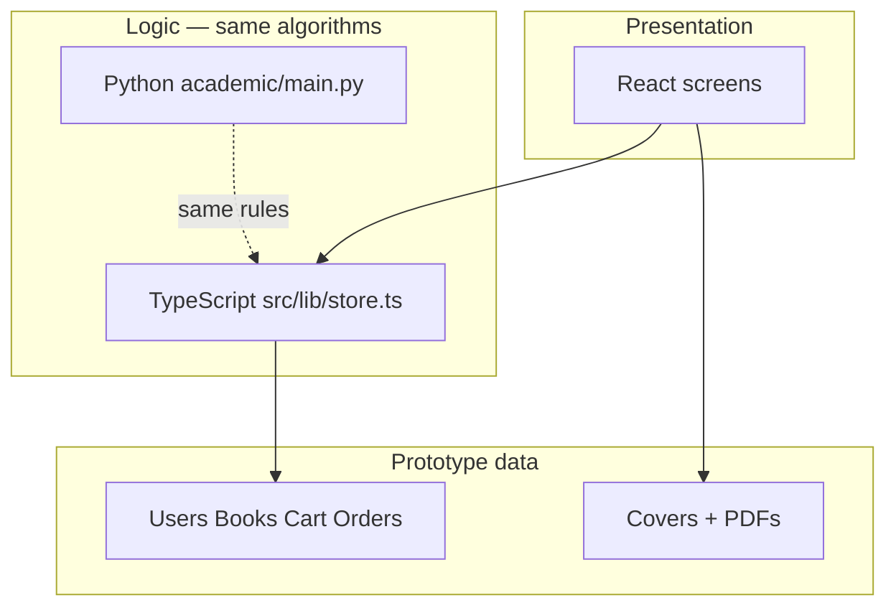
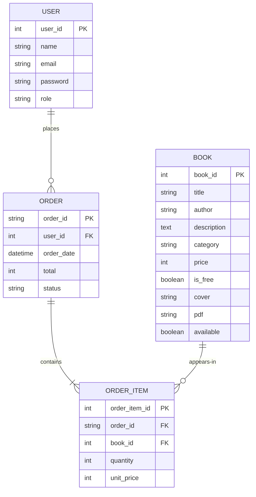

# 7. System Design

Design follows the brief: keep the architecture small, document a proper database even though the prototype does not run one, and make the interface look like a literary archive rather than a generic shop.

The implementation record ([[13-Implementation-Record]]) is the technology justification. This note is the design: architecture, data, and screens.

---

## 7.1 Architecture

Conceptual architecture, as specified and as built:

```text
USER
  │
  ▼
INTERFACE  (React screens: Home, Browse, Details, Reader,
            Cart, Checkout, Orders, Account, Admin)
  │
  ▼
APPLICATION LOGIC
  ├── Authentication
  ├── Catalogue
  ├── Search
  ├── Cart
  ├── Checkout
  ├── Orders
  └── Admin management
  │
  ├── live copy:     TypeScript store (src/lib/store.ts)
  └── academic copy: Python Archive     (academic/main.py)
  │
  ▼
IN-MEMORY DATA  (users, books, cart, orders)
  │
  └── Book covers and PDFs
```

There is no multi-server design. There is no separate API product. GitHub holds the source. A web host presents the interface because GitHub will not execute Python or paint a Flet window.



SEREIGN is the outer gateway in the concept: a larger house of collections. Luminary Archives is the room that is implemented.

---

## 7.2 Database design (intended / production)

The running prototype uses lists. The **intended** store is a normalised relational model. This is what would be built if the prototype were promoted.

### Entity-relationship diagram



### Tables

**USER**

| Column | Type | Notes |
| --- | --- | --- |
| user_id | integer, PK | Surrogate |
| name | varchar | Required |
| email | varchar, unique | Login key |
| password | varchar | Prototype: stored as entered |
| role | varchar | `buyer` or `admin` |

**BOOK**

| Column | Type | Notes |
| --- | --- | --- |
| book_id | integer, PK | |
| title | varchar | Required |
| author | varchar | Required |
| description | text | |
| category | varchar | |
| price | integer | ₦; 0 when free |
| is_free | boolean | |
| cover | varchar | Path to image |
| pdf | varchar | Path to file |
| available | boolean | |

**ORDER**

| Column | Type | Notes |
| --- | --- | --- |
| order_id | varchar, PK | `LA-0001` |
| user_id | integer, FK → USER | |
| order_date | datetime | |
| total | integer | ₦ |
| status | varchar | Prototype: `Completed` |

**ORDER_ITEM**

| Column | Type | Notes |
| --- | --- | --- |
| order_item_id | integer, PK | |
| order_id | varchar, FK → ORDER | |
| book_id | integer, FK → BOOK | |
| quantity | integer | Always 1 in this domain |
| unit_price | integer | Snapshot of price at purchase |

Cart is a session structure in the prototype (a list of `book_id`). In a future database it would be `CART_ITEM(user_id, book_id)` with a unique pair, which is exactly the “no duplicates” rule.

### Mapping to the prototype

| Relational table | Python | TypeScript |
| --- | --- | --- |
| USER | `User` dataclass | `User` type |
| BOOK | `Book` dataclass | `Book` type |
| ORDER | `Order` dataclass | `Order` type |
| ORDER_ITEM | `OrderItem` dataclass | `OrderItem` type |

---

## 7.3 Input / output design

| Process | Inputs | Outputs |
| --- | --- | --- |
| Register | name, email, password | new session or error |
| Login | email, password | session or error |
| Search | text, price filter, category | book cards or “No books found.” |
| Add to cart | book id | cart line or reason |
| Checkout | payment method, confirmation | `Order ID`, total, status |
| Read | book id, ownership | PDF view or friendly failure |
| Add book | catalogue fields | updated grid |
| Edit / delete book | book id + fields | updated grid |
| List orders | current user | table of that user’s (or all) orders |

Errors are ordinary sentences. They are never Python tracebacks.

---

## 7.4 Interface design

Visual language (from the specification, kept):

| Token | Use |
| --- | --- |
| Obsidian / near-black | Ground |
| Warm ivory | Primary text |
| Muted brass / gold | Accent, not decoration everywhere |
| Soft gray (ash) | Secondary text |
| Dark glass panels | Cards |
| Thin rules | Borders |

Typography: a display serif for titles (the archive voice), a clean sans for forms and navigation (the shop voice).

### Screens

| Screen | Layout intent |
| --- | --- |
| Home | Brand, tagline, search, featured, free, premium |
| Browse | Search + filters above a responsive grid (1 / 2 / 4 columns) |
| Details | Large cover, metadata, Read or Add to Cart |
| Reader | Frame for the PDF or an Open Book control |
| Cart | Lines, remove, total, checkout |
| Checkout | Customer, items, total, method, confirm |
| Confirmation | Order ID, total, links to orders and owned books |
| Orders | List of completed orders |
| Account | Identity, logout, owned books |
| Admin | Form + catalogue table + order list |
| Login / Register | Labelled fields, error slot, submit |

Navigation, always: **Home · Browse · Cart · Orders · Account**, plus **Admin** when the role allows it. Cart carries a badge.

Mobile: one column or a tight two-column grid; sticky header; tap-sized buttons; no locked desktop width.

---

## 7.5 Seed catalogue (the real books)

| ID | Title | Author | Category | Access | Price |
| ---: | --- | --- | --- | --- | ---: |
| 1 | The Prince | Niccolò Machiavelli | Politics | Free | 0 |
| 2 | The Art of War | Sun Tzu | Strategy | Free | 0 |
| 3 | Meditations | Marcus Aurelius | Philosophy | Free | 0 |
| 4 | White Nights | Fyodor Dostoevsky | Literature | Free | 0 |
| 5 | The Psychology of Money | Morgan Housel | Finance | Premium | 4,500 |
| 6 | Mastery | Robert Greene | Self-Mastery | Premium | 6,500 |
| 7 | The Laws of Human Nature | Robert Greene | Psychology | Premium | 7,200 |
| 8 | Ego Is the Enemy | Ryan Holiday | Philosophy | Premium | 4,200 |
| 9 | The Art of Thinking Clearly | Rolf Dobelli | Psychology | Premium | 3,800 |
| 10 | The Definitive Book of Body Language | Allan and Barbara Pease | Communication | Premium | 3,500 |
| 11 | The Daily Laws | Robert Greene | Wisdom | Premium | 5,500 |
| 12 | The 48 Laws of Power | Robert Greene | Power | Premium | 8,000 |

Filenames were not invented. They follow the supplied assets.

---

## 7.6 Security design (prototype honesty)

- Validate inputs at registration, login, checkout, and admin forms.  
- Separate roles in the interface and in the Python `require_admin` gate.  
- Do not display passwords on screen after entry.  
- Do not claim encryption, hashing, DRM, or PCI compliance.

That is the whole security design, and it is enough for a marked prototype only because the report says so in public.
