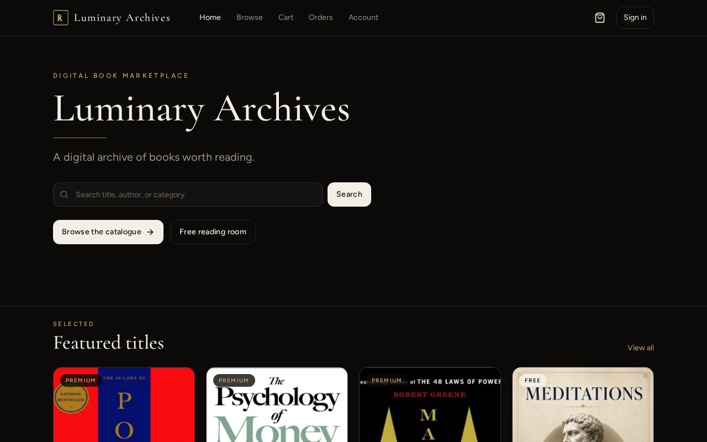
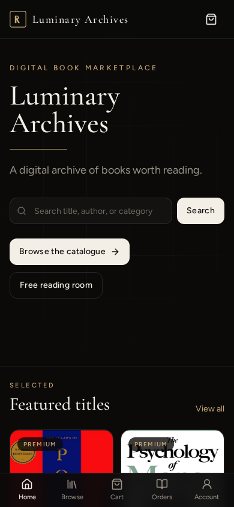
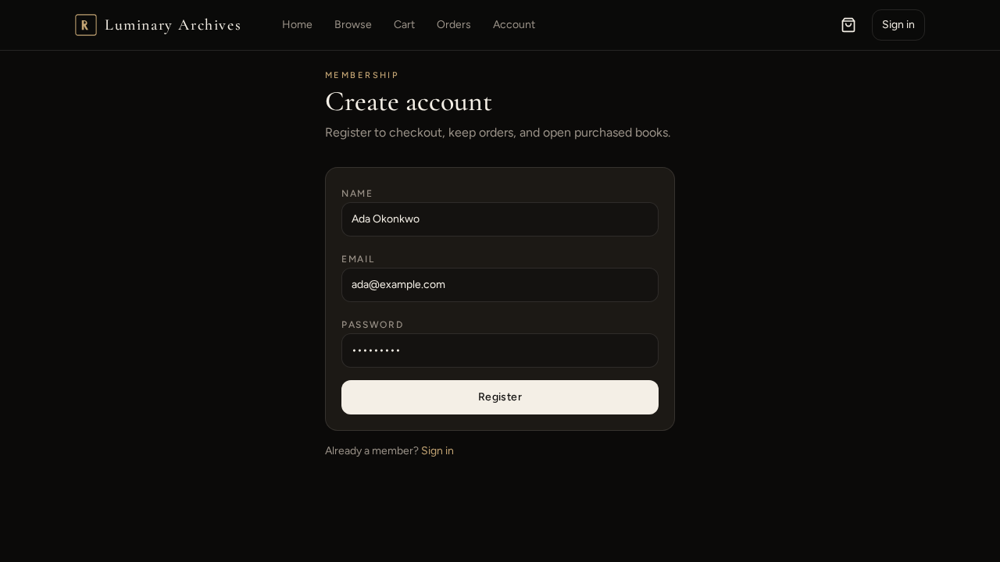
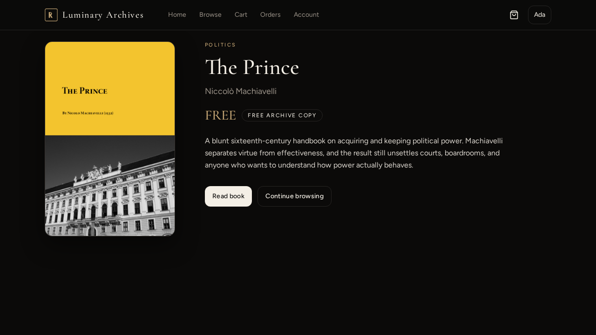
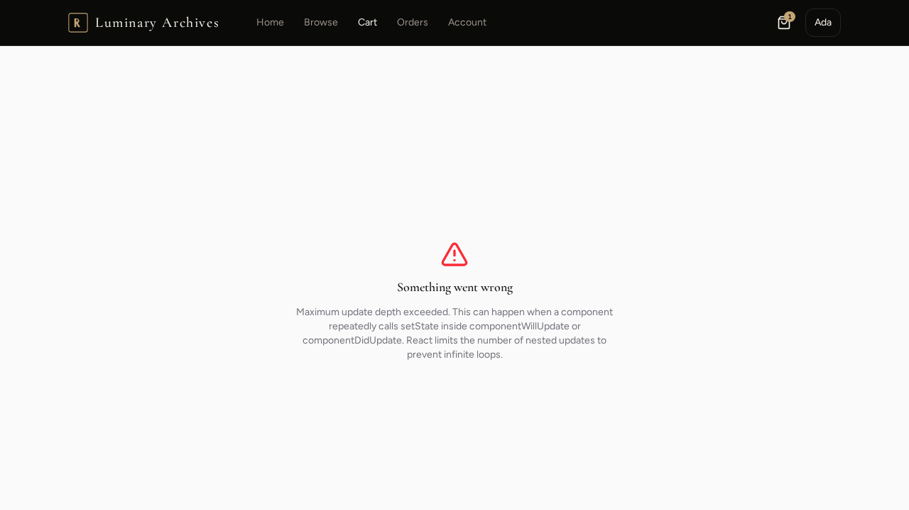
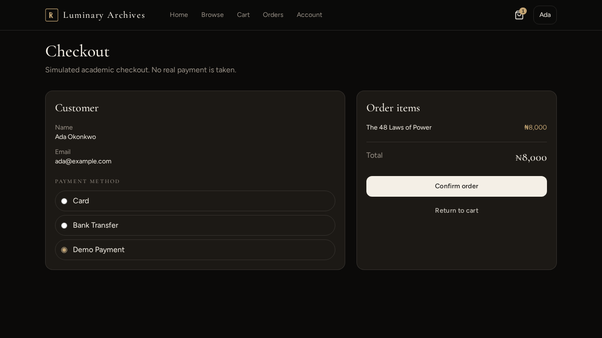
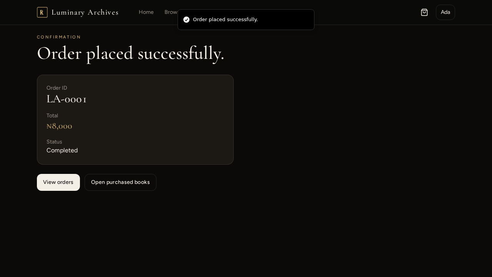

# 10. Screenshots

Captured from the working application. These are evidence, not mock-ups. Additional frames can be dropped into `assets/` and linked the same way.

The assignment asks for images of each working screen. The set below covers the buyer path that the definition of done requires, plus the register state used in testing.

---

## 10.1 Home — desktop

The first thing the archive says is its name. Search is on the same screen. Featured, free, and premium follow.

---

## 10.2 Home — mobile

The likely demonstration device. One column, tappable search, no horizontal overflow.

---

## 10.3 Registration

Name, email, password. Empty or duplicate attempts surface here as readable errors (see [[09-Testing-Evidence]] T-A1–T-A4).

---

## 10.4 Book details

Cover, identity, description. Free titles offer **Read Book**. Premium titles offer **Add to Cart**. The two must never look like the same verb.

---

## 10.5 Cart

Lines, prices, remove. Digital quantity is one. A second add does not clone the line.

---

## 10.6 Checkout

Customer, items, total, simulated payment method, confirm.

---

## 10.7 Order confirmation

The sentence the specification wanted, filled in:

> Order placed successfully.  
> Order ID: LA-0001  
> Total: ₦…

---

## 10.8 Remaining screens to capture into this folder

If a print of the report needs every heading the brief listed, capture these from the running app into `coursework/assets/` and add the same image syntax:

| Screen | Suggested filename | What to show |
| --- | --- | --- |
| Login | `login.png` | Email, password, error slot |
| Browse / catalogue | `browse.png` | Grid + search |
| Search / filter | `search-filter.png` | `prince` results; Free filter |
| Orders | `orders.png` | LA-0001 row |
| Account / owned books | `account.png` | Read actions |
| Admin catalogue | `admin.png` | Add form + table |
| Reader | `reader.png` | Open Book / PDF frame |

The application is running; these are not missing features. They are extra stills of features already tested.

---

## 10.9 Screenshot checklist against the brief

| Required evidence | Status in this vault |
| --- | --- |
| Login | Capture into `assets/login.png` from the live app |
| Registration | Present |
| Home | Present (desktop + mobile) |
| Browse / catalogue | Home grid + details; dedicated browse still optional |
| Book details | Present |
| Search / filter | Proven in Python log; still from Browse recommended |
| Cart | Present |
| Checkout | Present |
| Order confirmation | Present |
| Orders | Follows confirmation; still recommended |
| Admin catalogue | Proven in Python log; still from Admin recommended |
